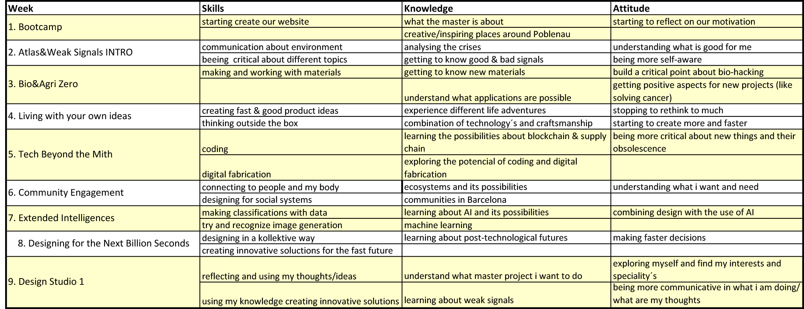

---
hide:
    - toc
---

# Bootcamp

In the first week (Bootcamp) they showed us all the possibilities for our Master-project in Poblenau, IAAC, Elisava and the FadLab. Where we can study, borrow inspiring readings, code electronics, build prototypes and ask experts. It was a perfect start to get to know everything and where to ask people if you have any questions. Also we start to reflect ourselves, which helped. At the beginning of the course I was not sure, in which direction I want to focus on and had problems about reflecting myself, but in the first week I learned already a lot about it. Showing our fight was a really good start to think about what is important for you and go on with your first thinking’s/feelings. In this master—program I would like to find out what I want and find my speciality.

